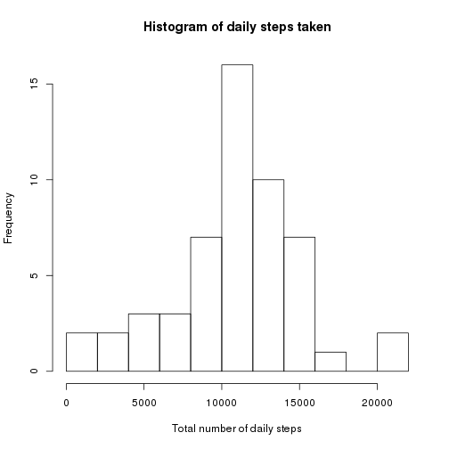
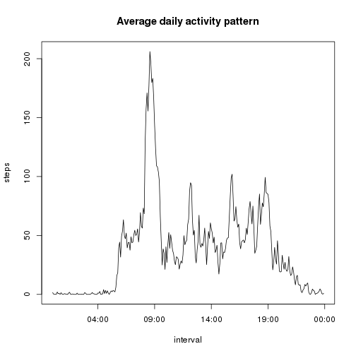
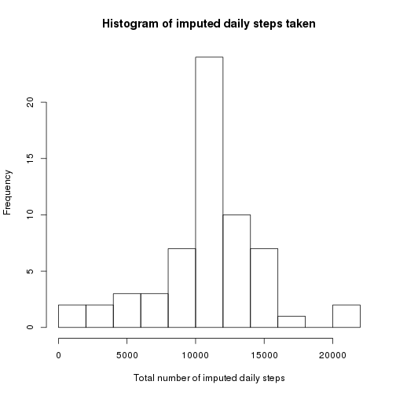
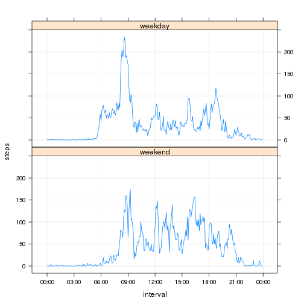

## Loading and preprocessing the data

The data used in this assignment is described in more detail in [README](https://github.com/johannat/RepData_PeerAssessment1/blob/master/README.md).

At first, we need to read the data and format the dates and times in suitable formats. The date in original data has character formatting "yyyy-mm-dd" whereas times are presented as integers HHMM.

As it seems that R has no pure time formats, the times are presented as POSIXct objects. This means that they all have the current date and the actual time and in using them anywhere they have to be specifically formatted to only show the hour and minute information. This way however, they can be used conveniently in aggregate() to group all the the 5-minute intervals together.


```r
if(!file.exists("activity.csv")) {
    unzip("activity.zip")
}
data <- read.csv("activity.csv")
data$date <- as.Date(data$date)
data$interval <- as.POSIXct(format(data$interval/100, nsmall = 2, width = 5,
                                   decimal.mark = ":"), format = "%H:%M")
```

## What is mean total number of steps taken per day?

For this part of the assignment, NAs are omitted. That is the default behaviour of aggregate().

The anonymous test person is walking relatively actively during most of the days.


```r
daily_totals <- aggregate(steps ~ date, data, sum)
hist(daily_totals$steps, breaks = 10, main = "Histogram of daily steps taken",
     xlab = "Total number of daily steps")
```

 


```r
mean_daily_total_steps <- mean(daily_totals$steps)
median_daily_total_steps <- median(daily_totals$steps)
summary(daily_totals$steps)
```

```
##    Min. 1st Qu.  Median    Mean 3rd Qu.    Max. 
##      41    8841   10760   10770   13290   21190
```

(S)he takes on average 10766.19 steps each day. The median is slightly smaller at 10765. This is in excess of the often quoted [10 000 step healthy goal for each day](http://www.nhs.uk/Livewell/loseweight/Pages/10000stepschallenge.aspx).

## What is the average daily activity pattern?

The anonymous test person shows a clear daily activity pattern.


```r
interval_means <- aggregate(steps ~ interval, data, mean)
with(interval_means, plot(interval, steps, type = "l",
                           main = "Average daily activity pattern"))
```

 

(S)he wakes up slighly before six o'clock, most probably walks to work between 8 and 9 o'clock, stays active throughout the day with peaks at around lunch time and after work until around 19 o'clock when (s)he starts to relax. (S)he goes to bed at latest at midnight. We can say with relatively high confidence that this person worked regular office hours during the measured time period.


```r
most_active_interval <- with(interval_means,
                             format(interval[which.max(steps)], "%H:%M"))
```

This person is most active on average during the 5-minute interval that starts at 08:35. This is during the time that (s)he most probably is walking to work in the morning.

## Imputing missing values

There's a significant number of missing values in the original data.


```r
sum(is.na(data$steps))
```

```
## [1] 2304
```

```r
percent_na <- 100*sum(is.na(data$steps))/length(data$steps)
```

A total of 13.1% values are missing. For the purposis of this analysis they are imputed by the daily averages for a particular interval.


```r
imputed_data <- data
nas <- is.na(imputed_data$steps)
imputed_data$steps[nas] <- rep(interval_means$steps, 31+30)[nas]
```

In this case, the imputing process was relatively straightforward as the data was organised chronologically and spaced evenly and equally for all days. There are 31 days in October and 30 in November.

The imputed daily steps are distributed similarly to the non-imputed steps. Visually there's no difference to be observed:


```r
imputed_daily_totals <- aggregate(steps ~ date, imputed_data, sum)
hist(imputed_daily_totals$steps, breaks = 10,
     main = "Histogram of imputed daily steps taken",
     xlab = "Total number of imputed daily steps")
```

 

The numbers tell a similar story:


```r
mean_diff <- mean(imputed_daily_totals$steps) - mean_daily_total_steps
median_diff <- median(imputed_daily_totals$steps) - median_daily_total_steps
summary(imputed_daily_totals$steps)
```

```
##    Min. 1st Qu.  Median    Mean 3rd Qu.    Max. 
##      41    9819   10770   10770   12810   21190
```

Based on the numbers above, the effect of imputing is very small in this case. The mean didn't change at all (difference is 0 steps) and the median increased only slightly by 1.19 steps. This seems to indicate that the missing values were distributed relatively evenly throughout the day.

## Are there differences in activity patterns between weekdays and weekends?

For the last part of the analysis, we have to separate the weekdays from Saturdays and Sundays. This happens by assigning a factor level "weekend" to any date that was a Saturday or a Sunday and another level "weekday" for the rest.


```r
data$day <- weekdays(data$date, abbreviate = TRUE) %in% c("Sat", "Sun")
data$day <- factor(data$day, levels = c(TRUE, FALSE), labels = c("weekend", "weekday"))
```

A visual comparison of the resulting data shows that the person in question seems to be working during the weekdays and probably has weekends off:


```r
library(lattice)
week_interval_totals <- aggregate(steps ~ interval + day, data, mean)
ticks = seq(min(week_interval_totals$interval), by = "3 hour", length = 9)
xyplot(steps ~ interval | day, data = week_interval_totals, type = c("l", "g"), layout = c(1, 2),
       scales = list(x = list(at = ticks, labels = format(ticks, "%H:%M"))))
```

 

(S)he wakes up on average a little later during the weekends and goes to bed a little later as well. Also the suspected morning walk to work is even more pronounced during the weekdays but equally absent from the weekend mornings. Otherwise the person in question seems to be leading an active life every day of the week.
